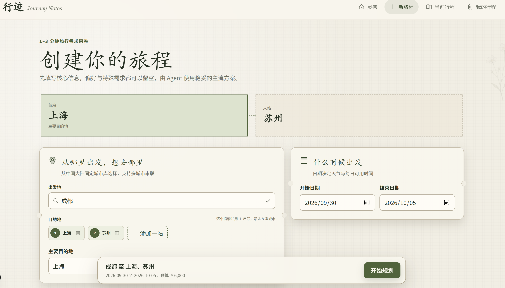
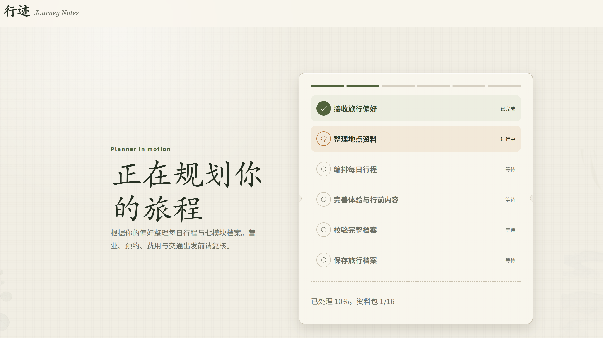
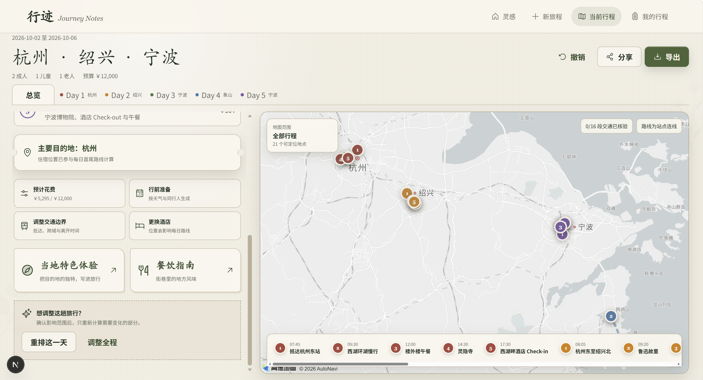
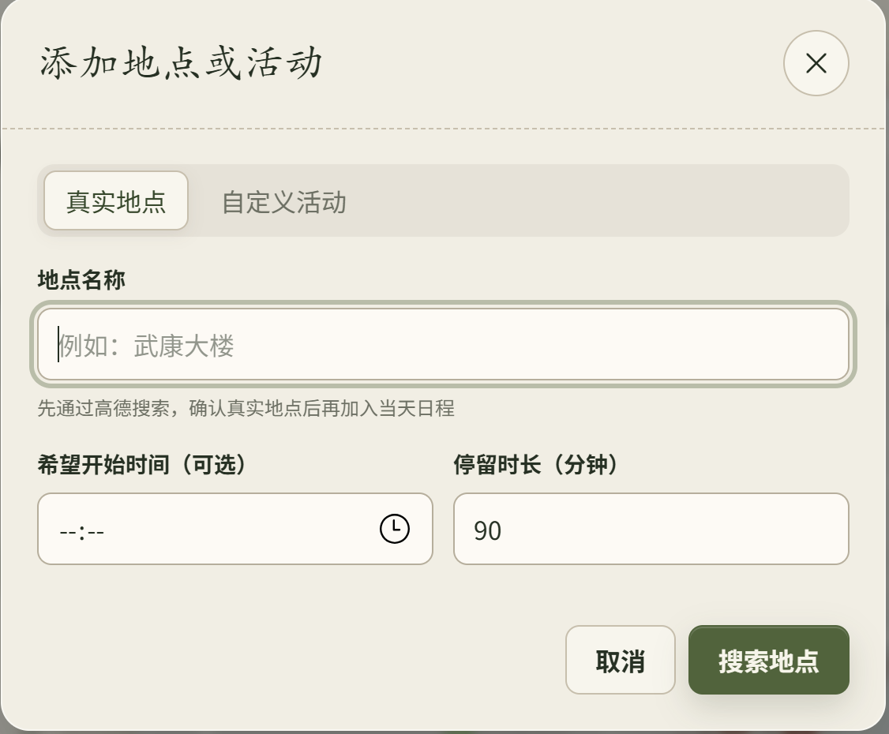

# 行迹 · Xingji

> 从一句想法开始，让每一天的停留、转身与出发，都有迹可循，也留有余地。

**行迹（Xingji）** 是一个面向中国境内旅行场景的 AI 旅行规划 Agent。它不仅生成“看起来合理”的行程，还会结合真实 POI、路线、营业信息、用户偏好、旅行节奏与临时修改要求，生成一份**可以继续调整、局部重排并逐步核验的旅行计划**。

项目目前聚焦于：  
**真实地点发现 → 行程生成 → 路线校验 → 节奏优化 → 用户修改 → Agent 局部重规划 → 动态信息核验**。

---

## 在线体验

- **在线 Demo：** `https://xingji-travel-agent.vercel.app`
- **GitHub Repository：** `https://github.com/eileen268/xingji-travel-agent`
- **演示视频：** `待补充`

---

## 项目截图

### 1. 首页 / Trip Creation


```text
docs/screenshots/home.png
```

---

### 2. 行程偏好 / User Preference



```text
docs/screenshots/preference.png
```

---

### 3. Generation Process / 行程生成过程



```text
docs/screenshots/generation.png
```

---

### 4. 行程结果 / Trip Result



```text
docs/screenshots/trip-result.png
```

---

### 5. 调整行程 / Editable Replanning


```text
docs/screenshots/replan.png
```

---

### 6. 手动添加行程 Add Place / Custom Activity



```text
docs/screenshots/add-place.png
```

---

## 为什么做这个项目

大多数旅行规划工具能够“推荐地点”，但真正可执行的旅行计划还需要解决很多更具体的问题：

- 用户给出的偏好不一定能直接转成可执行约束；
- LLM 生成的地点名称不一定是真实 POI；
- 同名地点、分店和模糊地点需要明确清晰；
- 景点之间的交通时间以及游玩时间需要被考虑到行程安排中；
- 餐厅、景点和休息时间需要符合人的旅行节奏；
- 用户修改一个地点时，应该要考虑剩下的行程和时间，合理规划一天的行程；
- 规划工具应该要考虑游客的来程和去程时间；
- 生成中断后，应保留已经完成的结果并支持继续生成。
- 旅行规划工具应该要根据旅行目的地的风俗习惯给游客提供温馨小锦囊

因此，行迹的目标不是简单做一个“LLM 行程文本生成器”，而是尝试构建一套：

> **LLM 负责理解与选择，Backend 负责事实、约束、验证与调度。**

---

# 核心能力

## 1. 个性化旅行规划

用户可以输入：

- 出发地 / 目的地
- 日期
- 预算
- 同行人
- 兴趣偏好
- 旅行节奏
- 交通偏好
- 额外自然语言要求

例如：

```text
上海玩 3 天，苏州玩 2 天。
第一天下午 3 点才到上海。
迪士尼安排一整天。
尽量少走路，午饭想吃本帮菜。
```

系统会将明确要求解析为结构化约束，而不是仅仅把文本塞给 LLM。

---

## 2. Structured User Constraints

行迹将用户自然语言中的部分明确要求编译为结构化约束，例如：

```text
“苏州玩 2 天”
→ city_stay_constraint

“30 号下午三点才到上海”
→ arrival_constraint

“迪士尼一定要去”
→ must_visit_constraint

“第二天轻松一点”
→ pace_constraint
```

系统优先遵循：

```text
显式结构化输入
>
从自然语言解析出的明确约束
>
系统默认推断
```

---

## 3. 真实 POI Resolution

LLM 不负责生成最终可执行的 POI ID。

系统会使用高德地图对地点进行二次核验：

```text
LLM / Candidate Place
↓
Name Normalization
↓
Amap Search
↓
Candidate Resolution
↓
Canonical POI
↓
Coordinates
```

对于同名地点或品牌分店，会结合：

- 城市
- 区域
- 类别
- 前后行程地点
- 当天区域
- 路线绕行成本

进行 context-aware resolution。

---

## 4. 高德真实路线

地点坐标确认后，系统通过高德路线服务计算真实交通信息。

支持：

- 步行
- 公共交通
- 驾车 / 出租车

路线数据不会被简单地写成 `0 分钟`。

当真实路线不可用时，系统会显式标记：

```text
unresolved
estimated
needs_recheck
```

而不是伪装成已验证结果。

---

## 5. Human Rhythm Constraints

行程不只追求“数学上排得进去”，也会考虑人的旅行节奏。

目前包含：

- Meal Rhythm
- Continuous Activity
- Long Transfer Recovery
- Daily Active Window
- Walking Load
- Activity Intensity
- Day Density

例如：

```text
午餐 preferred window
11:30–13:30
```

系统会尽量避免：

```text
景点
→ 景点
→ 景点
→ 14:30 才吃午饭
```

同时区分：

```text
Hard Constraint
Soft Constraint
Warning
```

避免因为过多硬约束导致整个 Scheduler 无解。

---

## 6. Editable Replanning

生成完成后，用户可以继续修改行程。

支持：

- 添加真实地点
- 添加自定义活动
- 删除地点
- 替换地点
- 修改停留时长
- 修改开始时间
- 修改交通方式
- 锁定地点
- 拖拽顺序
- 自然语言重排

例如：

```text
晚上 7 点加入东方明珠
```

系统会优先尝试：

```text
保留原有行程
↓
解析新地点
↓
计算真实路线
↓
检查营业时间
↓
寻找可插入时间
↓
生成 Preview
```

而不是直接重新生成整天行程。

---

## 7. Scoped Replanning

Agent 会根据自然语言判断调整范围：

```text
current_day
affected_days
whole_trip
```

例如：

```text
“今天轻松一点”
→ current_day

“迪士尼安排一天，其他景点放到别天”
→ affected_days

“整趟旅行都少走路”
→ whole_trip
```

系统不会静默扩大修改范围。

跨天调整会先提示用户，并生成 Diff Preview。

---

## 8. Preview → Confirm → Commit

所有重要修改遵循：

```text
用户输入
↓
Agent 理解
↓
Impact Analysis
↓
Preview
↓
用户确认
↓
Commit
```

Preview 会展示：

- Added
- Removed
- Moved
- Time Changed
- Transport Changed
- Affected Days

取消 Preview 时，原行程不会被修改。

---

## 9. 动态事实核验

开放时间、票价、预约规则属于动态事实。

系统不会让 LLM 直接编造这些信息。

数据优先级大致为：

```text
Official Website / Official Booking
>
Amap
>
Trusted Third-party Source
>
LLM descriptive content
```

官网发现流程：

```text
Canonical POI
↓
Official Source Cache
↓
Serper Search
↓
OfficialSourceResolver
↓
Official Website
↓
Fact Extractor
↓
Fact Store
```

对于无法确认的信息，系统会明确标记：

```text
needs_recheck
conflicting
unavailable
```

而不是伪装成确定事实。

---

## 10. Resumable Generation Pipeline

行程生成采用 Pack-based Pipeline。

主要阶段包括：

```text
framing
↓
places-core
↓
places-experiences
↓
places-food
↓
itinerary-plan
↓
itinerary-day-{n}
↓
itinerary-coherence
↓
modules-practical
↓
modules-language-notes
↓
destination-profile
```

每个 Pack 独立保存状态。

当某一步失败时：

- 已完成内容不会丢失；
- 可以只恢复失败 Pack；
- 不需要从头重新生成整趟旅行。

---

# Agent Pipeline

```text
User Input
    ↓
Framing
    ↓
User Constraint Compiler
    ↓
Place Research
    ↓
POI Resolution
    ↓
Global Itinerary Plan
    ↓
Place Allocation
    ↓
Route Calculation
    ↓
Daily Scheduler
    ↓
Human Rhythm Evaluation
    ↓
Coherence Validation
    ↓
Dynamic Fact Verification
    ↓
Destination Profile
    ↓
Editable Replanning
```

---

# 系统设计原则

## LLM 不负责一切

项目将不同任务拆分为：

### LLM 负责

- 用户意图理解
- 偏好理解
- 候选语义分析
- 行程主题
- Replan Intent Parsing
- 非确定性内容生成

### Backend 负责

- 日期
- 城市
- Canonical POI ID
- 坐标
- Route
- Scheduler
- Ownership
- Constraint Validation
- Reference Integrity
- Fact Verification
- Persistence
- Resume / Replay

---

## Minimize Hallucination

禁止：

- LLM 编造坐标
- LLM 编造高德 POI ID
- LLM 伪造实时营业时间
- LLM 直接决定真实路线
- 未经核验的动态信息被标记为 verified

---

## Minimum Impact Replanning

修改某一天时，默认只影响：

```text
必要的最小范围
```

例如：

```text
Add Place
→ 默认保留已有日程

Cross-day Replan
→ 只修改真正 affected days

Whole-trip Replan
→ 必须明确确认
```

---

# 技术栈

## Frontend

- React / Next.js
- TypeScript
- Zustand
- Responsive Web UI
- Desktop + Mobile adaptation

## Backend

- FastAPI
- Pydantic
- Python
- Async pipeline
- Pack-based persistence

## AI

- Zhipu GLM
- Structured Prompting
- Schema Validation
- Targeted Repair
- Replan Intent Parser

## Maps & POI

- Amap / 高德地图
- POI Search
- Route Planning
- Location Resolution

## Search & Verification

- Serper Search API
- Official Website Discovery
- Official Source Resolver
- Dynamic Fact Extraction

## Database

Development:

```text
SQLite
```

Deployment target:

```text
PostgreSQL
```

---

# 部署架构与密钥安全

```text
浏览器
  │  同源请求 /api/*、/_AMapService/*
  ▼
Vercel（Next.js）── rewrite ──▶ Railway（FastAPI + asyncio Worker）
  │                                │
  │ NEXT_PUBLIC_AMAP_JS_KEY        │ AMAP_SECURITY_JS_CODE（服务端注入 jscode）
  │ （公开，靠域名白名单保护）       │ AMAP_WEB_SERVICE_KEY（POI / 路线）
  │                                │ ZHIPU_API_KEY、SERPER_API_KEY
  │                                ▼
  │                          Persistent Volume → /data/travel.db
```

- 智谱、Serper、高德 Web 服务 Key 与高德安全密钥**只存在于 Railway 服务端环境变量**，不进入 GitHub，也不进入前端 bundle。
- 前端只持有高德 JS Key（`NEXT_PUBLIC_AMAP_JS_KEY`，浏览器端可见是该 Key 的正常使用形态），在高德控制台配置域名白名单防止盗用；安全码按高德官方"代理服务器转发"方案改为**服务端代理**：JS API 把所有高德服务请求指向同源固定前缀 `/_AMapService`（含 `v3/assistant/security/jscode` 动态密钥换取），经 Vercel 转发到 Railway，由 Railway 在请求上注入安全密钥（jscode）后按官方规则分发到高德对应主机（restapi / webapi / fmap01）并透传响应。
- 前端通过环境变量 `BACKEND_URL`（不带 `NEXT_PUBLIC_` 前缀，不进浏览器 bundle）指定后端地址；本地开发默认转发到 `http://localhost:8000`。
- 仓库中只保留 `.env.example`；真实 `.env`、`.env.local` 被 `.gitignore` 排除，历史提交中也不包含任何真实密钥。
- SQLite 数据库存放在 Railway Persistent Volume（`DATABASE_PATH=/data/travel.db`），启动时自动建表迁移；仓库 `backend/data/` 仅附带一份脱敏精简的示例库。
- 空数据卷首次启动时会自动导入该示例库（兰州 1 天行程，5 个地点均为真实高德 POI；上海+苏州 6 天行程，含完整重规划记录），线上"我的行程"开箱即可浏览真实地图标记与路线。示例库按 sha256 版本管理（卷上 `<数据库名>.seed.json` 标记）：卷为空、首版旧示例库、或示例版本落后且卷内只有示例任务时自动更新；一旦出现示例之外的真实用户任务，永远不再覆盖。

---

# 可恢复生成设计

任务状态：

```text
queued
running
repairing
validating
paused
done
done_with_warnings
failed
```

每个 Pack 会记录：

- generation attempts
- repair attempts
- resume count
- model
- prompt version
- schema version
- validator version
- scheduler version
- run_id
- warnings
- validation errors

---

# REAL_LLM / MOCK / REPLAY

项目支持多种执行模式：

## REAL_LLM

调用真实模型生成。

## MOCK

用于快速回归测试，不消耗模型 Token。

## REPLAY

基于已持久化 Pack 重放流程。

用途：

- 检查 Validator
- 检查 Scheduler
- Regression Test
- Debug
- 避免重复调用 LLM

---

# 关键工程问题与解决方案

## 1. LLM 输出与 Schema 不一致

问题：

```text
keep
remove
transportation_preference
```

与 Backend canonical schema 不一致，导致 Pydantic ValidationError。

解决：

```text
Canonical Contract
+
Normalizer
+
Pydantic Validation
+
Targeted Repair
```

---

## 2. POI ID 更新后出现 stale reference

问题：

```text
llm_xxx
↓
amap_xxx
```

上游已经替换，但下游 itinerary/module 仍引用旧 ID。

解决：

- Canonical Reference Remapping
- Dependency Signature
- Downstream Invalidation
- Final Reference Integrity Check

---

## 3. 路线缺失被错误显示为 0 分钟

解决：

```text
null != 0
```

路线不可用时显示：

```text
交通时间待计算
```

并保留：

- route status
- provider
- error reason

---

## 4. 用户自然语言要求没有真正约束行程

问题：

```text
“苏州玩2天”
“下午三点才到上海”
```

只被保存为 free text。

解决：

```text
User Notes
↓
Constraint Compiler
↓
StructuredTripConstraints
↓
Allocator / Scheduler
```

---

## 5. 新增地点导致原有日程被无理由删除

解决：

将 `add_place` 定义为：

> **Non-destructive by default**

只有出现真实不可行冲突并经过用户确认，才允许修改已有 stop。

---

# 项目结构

```text
xingji-travel-agent/
├── backend/                    # FastAPI 后端
│   ├── app/                    # API、Worker、管线、调度器、重规划、事实核验
│   │   ├── main.py             # 路由入口 + 进程内任务 Worker
│   │   ├── pipeline.py         # Pack 生成管线
│   │   ├── scheduler.py        # 逐日时间轴调度与节奏评估
│   │   ├── editable_replan.py  # 可编辑重规划（预览 / 确认 / 撤销）
│   │   ├── place_resolution.py # 高德 POI 消歧
│   │   ├── fact_verification.py# 动态事实核验
│   │   └── services/           # amap / google_places / official 等外部服务
│   ├── benchmark/              # 15 组固定回归用例
│   ├── benchmark_runs/         # Benchmark / PoC 结果
│   ├── data/                   # 脱敏示例库；线上由 Railway Volume 挂载
│   ├── schemas/                # JSON Schema 契约与审计文档
│   ├── scripts/ tests/ examples/
│   └── third_party/            # 上游 MIT 项目来源留档
│
├── frontend-standalone/        # Next.js 前端
│   ├── app/                    # 首页 / 创建 / 进度 / 行程 / 准备 / 导出 / 历史 / 分享
│   ├── components/ features/ lib/ store/ types/
│   └── public/destinations/    # 首页目的地插画
│
├── docs/screenshots/           # 项目截图
├── lanzhou-october-guide/      # 管线产出的静态兰州深度攻略（含研究过程数据）
└── README.md
```

---

# 本地运行

## 1. Clone

```bash
git clone https://github.com/eileen268/xingji-travel-agent.git
cd xingji-travel-agent
```

---

## 2. Backend

```bash
cd backend

python -m venv .venv
```

Windows:

```bash
.venv\Scripts\activate
```

macOS / Linux:

```bash
source .venv/bin/activate
```

安装依赖：

```bash
pip install -r requirements.txt
```

启动：

```bash
uvicorn app.main:app --reload
```

默认：

```text
http://127.0.0.1:8000
```

---

## 3. Frontend

```bash
cd frontend-standalone

npm install
npm run dev
```

默认：

```text
http://localhost:3000
```

---

# 环境变量

请创建：

```text
backend/.env
```

示例：

```env
# LLM
ZHIPU_API_KEY=
ZHIPU_MODEL=

# Amap
AMAP_API_KEY=

# Search
SERPER_API_KEY=

# Database
DATABASE_URL=

# Optional
ENABLE_GOOGLE_PLACES=false
ENABLE_GOOGLE_OFFICIAL_FALLBACK=false
```

> 不要将真实 API Key 提交到 GitHub。

建议将：

```text
.env
```

加入：

```text
.gitignore
```

---

# 测试

运行 Backend Tests：

```bash
pytest
```

建议重点覆盖：

- City Day Allocation
- Arrival / Departure Constraints
- POI Resolution
- Route Coverage
- Human Rhythm
- Meal Scheduling
- Add Place
- Remove / Replace
- Cross-day Replan
- Preview / Commit
- Replay / Resume
- Reference Integrity

---

# Demo

为了让首次访问用户更快理解项目，提供：

```text
查看示例行程
```

示例为：

```text
杭州 + 绍兴 + 宁波
5 天
```

用户可以直接体验：

- Day Tabs
- Map
- Add Place
- Replan
- Transport Edit
- Preview
- Dynamic Verification

无需等待完整 REAL_LLM 生成过程。

---

# Roadmap

## P1 · Agent Core ✅ / 基本完成

- [x] Pack-based generation
- [x] REAL_LLM / MOCK / REPLAY
- [x] POI resolution
- [x] Amap route
- [x] Scheduler
- [x] Human rhythm
- [x] Editable replanning
- [x] Structured user constraints
- [x] Dynamic fact verification
- [x] Resume / Replay
- [x] Observability

## P2 · Product Experience

- [x] Map-first result page
- [ ] Desktop / Mobile map interaction
- [ ] Weather integration
- [ ] Budget system
- [ ] Trip history
- [ ] Better revision / undo UX
- [ ] Notebook-style export

## P3 · Production

- [ ] PostgreSQL migration
- [ ] Anonymous session
- [ ] Rate limiting
- [ ] API budget control
- [ ] Public deployment
- [ ] Shareable trip URL

## P4 · Advanced Intelligence

- [ ] Hotel integration
- [ ] More advanced preference learning
- [ ] Active weather-aware replanning
- [ ] Personalized recommendation memory

---

# 我从这个项目中重点实践了什么

这个项目并不是单纯调用 LLM API，而是围绕“AI 产品如何真正可用”做了大量工程化尝试，包括：

- Structured User Intent
- Human-in-the-loop Replanning
- Deterministic + LLM Hybrid Architecture
- Tool Use
- POI Resolution
- Dynamic Fact Verification
- Stateful Agent Pipeline
- Resume / Replay
- Error Recovery
- Contract Consistency
- Cross-layer Validation
- Explainable Preview
- Minimum-impact Editing

---

# 项目目标

行迹希望解决的不是：

> “帮我生成一篇旅行攻略。”

而是：

> “帮我做一份真实、可执行、可继续调整的旅行计划。”

用户可以改变主意，行程也应该能跟着改变。

---

# License

本项目采用 MIT License 开源。

第三方来源 `backend/third_party/personalized-travel-guide` 基于 TokenHungryMash/personalized-travel-guide-skill（MIT，锁定提交 `7372e4762eea2767bd0a49c949f33c70bed92a67`），完整 MIT 声明见 `backend/third_party/personalized-travel-guide/LICENSE`。

---

# Contact

- GitHub: [@eileen268](https://github.com/eileen268)
- Email: `zhuyil2004@163.com`

---

## 行迹

> **旅行从来不只是抵达某个地方，而是把喜欢的风景、合适的节奏和一路上的期待，慢慢连成一条属于自己的路。**  
> **行迹，从一句想法开始。让每一天的停留、转身与出发，都有迹可循，也留有余地。**
